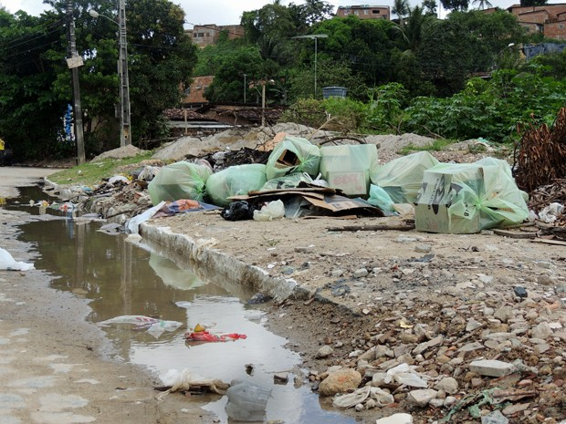

```{r setup, include=FALSE}
knitr::opts_chunk$set(echo = TRUE)
```

```{r include=FALSE}
defaultW <- getOption("warn") 
options(warn = -1, warn.conflicts=F) 
```

<center>

Este trabalho foi desenvolvido como projeto final da disciplina Computação para Análise de Dados, lecionada pelo Professor Ermeson Andrade.

</center>

# {.tabset}

## Introdução

A dengue é uma doença causada por vírus, que tem por sintomas característicos febre elevada (com duração de até 7 dias), dores musculares e nas juntas, dor de cabeça e nos olhos, falta de apetite e manchas vermelhas no corpo (dengue clássica). A transmissão se dá quando o mosquito Aedes aegypti, após sugar o sangue de uma pessoa infectada, pica uma pessoa sadia e transmite o vírus. Após 3 a 5 dias da picada, a pessoa poderá apresentar os primeiros sintomas.


A dengue clássica pode apresentar complicações, inclusive com ocorrência de pequenos sangramentos, o que não significa que é dengue hemorrágica. Já a dengue hemorrágica é a forma grave da doença, e ocorre geralmente quando a pessoa teve dengue anteriormente (a pessoa pode ou não saber). A confirmação da dengue hemorrágica é feita por exame clínico (feito pelo médico) e laboratorial. Geralmente no 5° dia, a doença pode evoluir para um estado de gravidade.

A melhor forma de se evitar a dengue é combater os focos de acúmulo de água, locais propícios para a criação do mosquito transmissor da doença. Para isso, é importante não acumular água em latas, embalagens, copos plásticos, tampinhas de refrigerantes, pneus velhos, vasinhos de plantas, jarros de flores, garrafas, caixas d’água, tambores, latões, cisternas, sacos plásticos e lixeiras, entre outros.

Diante disto, parece haver uma relação próxima entre saneamento e a dengue, além da prevenção que cada cidadão deve ter em sua própria residência. Então, este trabalho se destina a mapear as áreas da cidade do Recife e suas características com os dados fornecidos pela Prefeitura do Recife entre 2013 e 2018. Serão analisadas os bairros, as características das pessoas que tiveram a doença (idade, sexo, entre outras), quantidade de diagnósticos, óbitos, dentre outros fatores, buscando extrair informações úteis que possam contribuir para um entendimento de como a doença afetou a cidade no passado e sob quais condições, permitindo que as informações obtidas possam auxiliar no combate e prevenção de maneira mais assertiva, precisa e eficiente.

## Dataset

Os dados foram obtidos através do portal de Dados Abertos da Prefeitura de Recife, e estão disponíveis no link [http://dados.recife.pe.gov.br/dataset/casos-de-dengue-zika-e-chikungunya](http://dados.recife.pe.gov.br/dataset/casos-de-dengue-zika-e-chikungunya). Foram utilizados os seguintes datasets:

* [Casos de Dengue em 2013](http://dados.recife.pe.gov.br/dataset/2a9b1c39-0700-4ddf-9a10-b3c8d5d9396c/resource/9f1226b3-59df-4a14-8410-613bf5bad86b/download/casos-dengue2013.csv)
* [Casos de Dengue em 2014](http://dados.recife.pe.gov.br/dataset/2a9b1c39-0700-4ddf-9a10-b3c8d5d9396c/resource/c4419939-323a-42a0-8774-ed88ef5ab40d/download/casos-dengue2014.csv)
* [Casos de Dengue em 2015](http://dados.recife.pe.gov.br/dataset/2a9b1c39-0700-4ddf-9a10-b3c8d5d9396c/resource/b686ebbf-5f54-4116-9227-0be464b9aedd/download/casos-dengue2015.csv)
* [Casos de Dengue em 2016](http://dados.recife.pe.gov.br/dataset/2a9b1c39-0700-4ddf-9a10-b3c8d5d9396c/resource/2a2ef847-7063-462e-bf76-a49ebc9a6d13/download/casos-dengue2016.csv)
* [Casos de Dengue em 2017](http://dados.recife.pe.gov.br/dataset/2a9b1c39-0700-4ddf-9a10-b3c8d5d9396c/resource/875bcd06-e2e9-4a55-9b5b-54b8cd87f8eb/download/caso-dengue2017.csv)
* [Casos de Dengue em 2018](http://dados.recife.pe.gov.br/dataset/2a9b1c39-0700-4ddf-9a10-b3c8d5d9396c/resource/d754bf5a-edbe-4a60-bca9-8c4252d223c8/download/caso-dengue2018.csv)

Além destes, os seguintes metadados foram utilizados para consulta, melhor compreensão dos datasets e para que adaptações necessárias fossem feitas corretamente, como a criação de fatores facilmente compreensíveis, ao invés da utilização de variáveis numéricas em vários casos:

* [Dengue metadados 2013-2015](http://dados.recife.pe.gov.br/dataset/2a9b1c39-0700-4ddf-9a10-b3c8d5d9396c/resource/8d9c970e-2616-48a1-9184-716ccb36cb46/download/dengue-metadados2015.json)
* [Dengue metadados 2016-2018](http://dados.recife.pe.gov.br/dataset/2a9b1c39-0700-4ddf-9a10-b3c8d5d9396c/resource/8f25ed76-de28-4082-89a7-113cad9a31be/download/dengue-metadados2016.json)

## Pacotes Requeridos

Os seguintes pacotes foram utilizados no projeto: 
```{r include=FALSE, message=FALSE}
install.packages("tidyverse", repos = "http://cran.us.r-project.org")
```

```{r message=FALSE}
library(tidyverse)
library(knitr)
```

**Tidyverse** é uma coleção de pacotes R de código aberto destinados à ciência dos dados.
**Knitr** é um pacote R que permite a integração do código R nos documentos LaTeX, LyX, HTML, Markdown, AsciiDoc e reStructuredText.

## Preparação dos Dados {.tabset}


### Carregando e Ajustando os Primeiros Dados

Nesta primeira etapa, os arquivos foram carregados em dataframes, para análise individual.

```{r}
data2013 <- read.csv("casos-dengue2013.csv", header = TRUE, sep = ";", encoding = "UTF-8")
data2014 <- read.csv("casos-dengue2014.csv", header = TRUE, sep = ";", encoding = "UTF-8")
data2015 <- read.csv("casos-dengue2015.csv", header = TRUE, sep = ";", encoding = "UTF-8")
data2016 <- read.csv("casos-dengue2016.csv", header = TRUE, sep = ";", encoding = "UTF-8")
data2017 <- read.csv("casos-dengue2017.csv", header = TRUE, sep = ";", encoding = "UTF-8")
data2018 <- read.csv("casos-dengue2018.csv", header = TRUE, sep = ";", encoding = "UTF-8")
```

O primeiro ajuste necessário foi o cabeçalho da variável *nu_notificacao*, do dataset *data2015*. Ao ler o arquivo CSV, o cabeçalho veio acompanhado de caracteres estranhos. Então, ele foi renomeado de acordo com o metadado, ficando compatível com os demais dataframes, facilitando uma eventual combinação. 

```{r}
names(data2015)[names(data2015) == "ï..nu_notificacao"] <- "nu_notificacao"
```

O *co_cbo_ocupacao*, ou Classificação Brasileira de Ocupações, faz mais sentido ser representado como *numeric*, ao invés de *char*.

```{r}
data2013$co_cbo_ocupacao <- as.numeric(data2013$co_cbo_ocupacao)
data2014$co_cbo_ocupacao <- as.numeric(data2014$co_cbo_ocupacao)
data2015$co_cbo_ocupacao <- as.numeric(data2015$co_cbo_ocupacao)
data2016$co_cbo_ocupacao <- as.numeric(data2016$co_cbo_ocupacao)
data2017$co_cbo_ocupacao <- as.numeric(data2017$co_cbo_ocupacao)
data2018$co_cbo_ocupacao <- as.numeric(data2018$co_cbo_ocupacao)
```

### Ajustando as datas {.tabset}

Mesmo sendo equivalentes, as colunas de datas foram preenchidas em formatos diferentes entre um ano e outro. Portanto, decidi separar as datas em dia, mês e ano, para maior flexibilidade, simplicidade e compatibilidade.

Como os formatos eram diferentes, foi necessário tratar cada dataset individualmente.

#### 2013 
```{r}
data2013 <- data2013 %>%
  separate(col = "dt_notificacao", into = c("ano_notificacao", "mes_notificacao", "dia_notificacao"), sep = "/")
data2013 <- data2013 %>%
  separate(col = "dia_notificacao", into = c("dia_notificacao", "hora_notificacao"), sep = " ")
data2013$ano_notificacao <- as.numeric(data2013$ano_notificacao)
data2013$mes_notificacao <- as.numeric(data2013$mes_notificacao)
data2013$dia_notificacao <- as.numeric(data2013$dia_notificacao)

data2013 <- data2013 %>%
  separate(col = "dt_diagnostico_sintoma", into = c("ano_diagnostico_sintoma", "mes_diagnostico_sintoma", "dia_diagnostico_sintoma"), sep = "/")
data2013 <- data2013 %>%
  separate(col = "dia_notificacao", into = c("dia_diagnostico_sintoma", "hora_diagnostico_sintoma"), sep = " ")
data2013$ano_diagnostico_sintoma <- as.numeric(data2013$ano_diagnostico_sintoma)
data2013$mes_diagnostico_sintoma <- as.numeric(data2013$mes_diagnostico_sintoma)
data2013$dia_diagnostico_sintoma <- as.numeric(data2013$dia_diagnostico_sintoma)

data2013 <- data2013 %>%
  separate(col = "dt_nascimento", into = c("ano_nascimento", "mes_nascimento", "dia_nascimento"), sep = "/")
data2013 <- data2013 %>%
  separate(col = "dia_nascimento", into = c("dia_nascimento", "hora_dia_nascimento"), sep = " ")
data2013$ano_nascimento <- as.numeric(data2013$ano_nascimento)
data2013$mes_nascimento <- as.numeric(data2013$mes_nascimento)
data2013$dia_nascimento <- as.numeric(data2013$dia_nascimento)

data2013 <- data2013 %>%
  separate(col = "dt_digitacao", into = c("ano_digitacao", "mes_digitacao", "dia_digitacao"), sep = "/")
data2013 <- data2013 %>%
  separate(col = "dia_digitacao", into = c("dia_digitacao", "hora_digitacao"), sep = " ")
data2013$ano_digitacao <- as.numeric(data2013$ano_digitacao)
data2013$mes_digitacao <- as.numeric(data2013$mes_digitacao)
data2013$dia_digitacao <- as.numeric(data2013$dia_digitacao)

data2013 <- data2013 %>%
  separate(col = "dt_investigacao", into = c("ano_investigacao", "mes_investigacao", "dia_investigacao"), sep = "/")
data2013 <- data2013 %>%
  separate(col = "dia_investigacao", into = c("dia_investigacao", "hora_investigacao"), sep = " ")
data2013$ano_investigacao <- as.numeric(data2013$ano_investigacao)
data2013$mes_investigacao <- as.numeric(data2013$mes_investigacao)
data2013$dia_investigacao <- as.numeric(data2013$dia_investigacao)

data2013 <- data2013 %>%
  separate(col = "dt_obito", into = c("ano_obito", "mes_obito", "dia_obito"), sep = "/")
data2013 <- data2013 %>%
  separate(col = "dia_obito", into = c("dia_obito", "hora_obito"), sep = " ")
data2013$ano_obito <- as.numeric(data2013$ano_obito)
data2013$mes_obito <- as.numeric(data2013$mes_obito)
data2013$dia_obito <- as.numeric(data2013$dia_obito)

data2013 <- data2013 %>%
  separate(col = "dt_encerramento", into = c("ano_encerramento", "mes_encerramento", "dia_encerramento"), sep = "/")
data2013 <- data2013 %>%
  separate(col = "dia_encerramento", into = c("dia_encerramento", "hora_encerramento"), sep = " ")
data2013$ano_encerramento <- as.numeric(data2013$ano_encerramento)
data2013$mes_encerramento <- as.numeric(data2013$mes_encerramento)
data2013$dia_encerramento <- as.numeric(data2013$dia_encerramento)

data2013 <- data2013 %>%
  separate(col = "dt_internacao", into = c("ano_internacao", "mes_internacao", "dia_internacao"), sep = "/")
data2013 <- data2013 %>%
  separate(col = "dia_internacao", into = c("dia_internacao", "hora_internacao"), sep = " ")
data2013$ano_internacao <- as.numeric(data2013$ano_internacao)
data2013$mes_internacao <- as.numeric(data2013$mes_internacao)
data2013$dia_internacao <- as.numeric(data2013$dia_internacao)
```

#### 2014

```{r}
data2014 <- data2014 %>%
  separate(col = "dt_notificacao", into = c("ano_notificacao", "mes_notificacao", "dia_notificacao"), sep = "/")
data2014 <- data2014 %>%
  separate(col = "dia_notificacao", into = c("dia_notificacao", "hora_notificacao"), sep = " ")
data2014$ano_notificacao <- as.numeric(data2014$ano_notificacao)
data2014$mes_notificacao <- as.numeric(data2014$mes_notificacao)
data2014$dia_notificacao <- as.numeric(data2014$dia_notificacao)

data2014 <- data2014 %>%
  separate(col = "dt_diagnostico_sintoma", into = c("ano_diagnostico_sintoma", "mes_diagnostico_sintoma", "dia_diagnostico_sintoma"), sep = "/")
data2014 <- data2014 %>%
  separate(col = "dia_notificacao", into = c("dia_diagnostico_sintoma", "hora_diagnostico_sintoma"), sep = " ")
data2014$ano_diagnostico_sintoma <- as.numeric(data2014$ano_diagnostico_sintoma)
data2014$mes_diagnostico_sintoma <- as.numeric(data2014$mes_diagnostico_sintoma)
data2014$dia_diagnostico_sintoma <- as.numeric(data2014$dia_diagnostico_sintoma)

data2014 <- data2014 %>%
  separate(col = "dt_nascimento", into = c("ano_nascimento", "mes_nascimento", "dia_nascimento"), sep = "/")
data2014 <- data2014 %>%
  separate(col = "dia_nascimento", into = c("dia_nascimento", "hora_dia_nascimento"), sep = " ")
data2014$ano_nascimento <- as.numeric(data2014$ano_nascimento)
data2014$mes_nascimento <- as.numeric(data2014$mes_nascimento)
data2014$dia_nascimento <- as.numeric(data2014$dia_nascimento)

data2014 <- data2014 %>%
  separate(col = "dt_digitacao", into = c("ano_digitacao", "mes_digitacao", "dia_digitacao"), sep = "/")
data2014 <- data2014 %>%
  separate(col = "dia_digitacao", into = c("dia_digitacao", "hora_digitacao"), sep = " ")
data2014$ano_digitacao <- as.numeric(data2014$ano_digitacao)
data2014$mes_digitacao <- as.numeric(data2014$mes_digitacao)
data2014$dia_digitacao <- as.numeric(data2014$dia_digitacao)

data2014 <- data2014 %>%
  separate(col = "dt_investigacao", into = c("ano_investigacao", "mes_investigacao", "dia_investigacao"), sep = "/")
data2014 <- data2014 %>%
  separate(col = "dia_investigacao", into = c("dia_investigacao", "hora_investigacao"), sep = " ")
data2014$ano_investigacao <- as.numeric(data2014$ano_investigacao)
data2014$mes_investigacao <- as.numeric(data2014$mes_investigacao)
data2014$dia_investigacao <- as.numeric(data2014$dia_investigacao)

data2014 <- data2014 %>%
  separate(col = "dt_obito", into = c("ano_obito", "mes_obito", "dia_obito"), sep = "/")
data2014 <- data2014 %>%
  separate(col = "dia_obito", into = c("dia_obito", "hora_obito"), sep = " ")
data2014$ano_obito <- as.numeric(data2014$ano_obito)
data2014$mes_obito <- as.numeric(data2014$mes_obito)
data2014$dia_obito <- as.numeric(data2014$dia_obito)

data2014 <- data2014 %>%
  separate(col = "dt_encerramento", into = c("ano_encerramento", "mes_encerramento", "dia_encerramento"), sep = "/")
data2014 <- data2014 %>%
  separate(col = "dia_encerramento", into = c("dia_encerramento", "hora_encerramento"), sep = " ")
data2014$ano_encerramento <- as.numeric(data2014$ano_encerramento)
data2014$mes_encerramento <- as.numeric(data2014$mes_encerramento)
data2014$dia_encerramento <- as.numeric(data2014$dia_encerramento)

data2014 <- data2014 %>%
  separate(col = "dt_internacao", into = c("ano_internacao", "mes_internacao", "dia_internacao"), sep = "/")
data2014 <- data2014 %>%
  separate(col = "dia_internacao", into = c("dia_internacao", "hora_internacao"), sep = " ")
data2014$ano_internacao <- as.numeric(data2014$ano_internacao)
data2014$mes_internacao <- as.numeric(data2014$mes_internacao)
data2014$dia_internacao <- as.numeric(data2014$dia_internacao)
```

#### 2015

```{r}
data2015 <- data2015 %>%
  separate(col = "dt_notificacao", into = c("ano_notificacao", "mes_notificacao", "dia_notificacao"), sep = "-")
data2015 <- data2015 %>%
  separate(col = "dia_notificacao", into = c("dia_notificacao", "hora_notificacao"), sep = " ")
data2015$ano_notificacao <- as.numeric(data2015$ano_notificacao)
data2015$mes_notificacao <- as.numeric(data2015$mes_notificacao)
data2015$dia_notificacao <- as.numeric(data2015$dia_notificacao)

data2015 <- data2015 %>%
  separate(col = "dt_diagnostico_sintoma", into = c("ano_diagnostico_sintoma", "mes_diagnostico_sintoma", "dia_diagnostico_sintoma"), sep = "-")
data2015 <- data2015 %>%
  separate(col = "dia_notificacao", into = c("dia_diagnostico_sintoma", "hora_diagnostico_sintoma"), sep = " ")
data2015$ano_diagnostico_sintoma <- as.numeric(data2015$ano_diagnostico_sintoma)
data2015$mes_diagnostico_sintoma <- as.numeric(data2015$mes_diagnostico_sintoma)
data2015$dia_diagnostico_sintoma <- as.numeric(data2015$dia_diagnostico_sintoma)

data2015 <- data2015 %>%
  separate(col = "dt_nascimento", into = c("ano_nascimento", "mes_nascimento", "dia_nascimento"), sep = "-")
data2015 <- data2015 %>%
  separate(col = "dia_nascimento", into = c("dia_nascimento", "hora_dia_nascimento"), sep = " ")
data2015$ano_nascimento <- as.numeric(data2015$ano_nascimento)
data2015$mes_nascimento <- as.numeric(data2015$mes_nascimento)
data2015$dia_nascimento <- as.numeric(data2015$dia_nascimento)

data2015 <- data2015 %>%
  separate(col = "dt_digitacao", into = c("ano_digitacao", "mes_digitacao", "dia_digitacao"), sep = "-")
data2015 <- data2015 %>%
  separate(col = "dia_digitacao", into = c("dia_digitacao", "hora_digitacao"), sep = " ")
data2015$ano_digitacao <- as.numeric(data2015$ano_digitacao)
data2015$mes_digitacao <- as.numeric(data2015$mes_digitacao)
data2015$dia_digitacao <- as.numeric(data2015$dia_digitacao)

data2015 <- data2015 %>%
  separate(col = "dt_investigacao", into = c("ano_investigacao", "mes_investigacao", "dia_investigacao"), sep = "-")
data2015 <- data2015 %>%
  separate(col = "dia_investigacao", into = c("dia_investigacao", "hora_investigacao"), sep = " ")
data2015$ano_investigacao <- as.numeric(data2015$ano_investigacao)
data2015$mes_investigacao <- as.numeric(data2015$mes_investigacao)
data2015$dia_investigacao <- as.numeric(data2015$dia_investigacao)

data2015 <- data2015 %>%
  separate(col = "dt_obito", into = c("ano_obito", "mes_obito", "dia_obito"), sep = "-")
data2015 <- data2015 %>%
  separate(col = "dia_obito", into = c("dia_obito", "hora_obito"), sep = " ")
data2015$ano_obito <- as.numeric(data2015$ano_obito)
data2015$mes_obito <- as.numeric(data2015$mes_obito)
data2015$dia_obito <- as.numeric(data2015$dia_obito)

data2015 <- data2015 %>%
  separate(col = "dt_encerramento", into = c("ano_encerramento", "mes_encerramento", "dia_encerramento"), sep = "-")
data2015 <- data2015 %>%
  separate(col = "dia_encerramento", into = c("dia_encerramento", "hora_encerramento"), sep = " ")
data2015$ano_encerramento <- as.numeric(data2015$ano_encerramento)
data2015$mes_encerramento <- as.numeric(data2015$mes_encerramento)
data2015$dia_encerramento <- as.numeric(data2015$dia_encerramento)

data2015 <- data2015 %>%
  separate(col = "dt_internacao", into = c("ano_internacao", "mes_internacao", "dia_internacao"), sep = "-")
data2015 <- data2015 %>%
  separate(col = "dia_internacao", into = c("dia_internacao", "hora_internacao"), sep = " ")
data2015$ano_internacao <- as.numeric(data2015$ano_internacao)
data2015$mes_internacao <- as.numeric(data2015$mes_internacao)
data2015$dia_internacao <- as.numeric(data2015$dia_internacao)
```

#### 2016

```{r}
data2016 <- data2016 %>%
  separate(col = "dt_notificacao", into = c("dia_notificacao", "mes_notificacao", "ano_notificacao"), sep = "-")
data2016$ano_notificacao <- as.numeric(data2016$ano_notificacao)
data2016$mes_notificacao <- as.numeric(data2016$mes_notificacao)
data2016$dia_notificacao <- as.numeric(data2016$dia_notificacao)

data2016 <- data2016 %>%
  separate(col = "dt_diagnostico_sintoma", into = c("dia_diagnostico_sintoma", "mes_diagnostico_sintoma", "ano_diagnostico_sintoma"), sep = "-")
data2016$ano_diagnostico_sintoma <- as.numeric(data2016$ano_diagnostico_sintoma)
data2016$mes_diagnostico_sintoma <- as.numeric(data2016$mes_diagnostico_sintoma)
data2016$dia_diagnostico_sintoma <- as.numeric(data2016$dia_diagnostico_sintoma)

data2016 <- data2016 %>%
  separate(col = "dt_nascimento", into = c("dia_nascimento", "mes_nascimento", "ano_nascimento"), sep = "-")
data2016$ano_nascimento <- as.numeric(data2016$ano_nascimento)
data2016$mes_nascimento <- as.numeric(data2016$mes_nascimento)
data2016$dia_nascimento <- as.numeric(data2016$dia_nascimento)

data2016 <- data2016 %>%
  separate(col = "dt_investigacao", into = c("dia_investigacao", "mes_investigacao", "ano_investigacao"), sep = "-")
data2016$ano_investigacao <- as.numeric(data2016$ano_investigacao)
data2016$mes_investigacao <- as.numeric(data2016$mes_investigacao)
data2016$dia_investigacao <- as.numeric(data2016$dia_investigacao)

data2016 <- data2016 %>%
  separate(col = "dt_digitacao", into = c("dia_digitacao", "mes_digitacao", "ano_digitacao"), sep = "/")
data2016$ano_digitacao <- as.numeric(data2016$ano_digitacao)
data2016$mes_digitacao <- as.numeric(data2016$mes_digitacao)
data2016$dia_digitacao <- as.numeric(data2016$dia_digitacao)

data2016 <- data2016 %>%
  separate(col = "dt_obito", into = c("dia_obito", "mes_obito", "ano_obito"), sep = "-")
data2016$ano_obito <- as.numeric(data2016$ano_obito)
data2016$mes_obito <- as.numeric(data2016$mes_obito)
data2016$dia_obito <- as.numeric(data2016$dia_obito)

data2016 <- data2016 %>%
  separate(col = "dt_encerramento", into = c("dia_encerramento", "mes_encerramento", "ano_encerramento"), sep = "-")
data2016$ano_encerramento <- as.numeric(data2016$ano_encerramento)
data2016$mes_encerramento <- as.numeric(data2016$mes_encerramento)
data2016$dia_encerramento <- as.numeric(data2016$dia_encerramento)

data2016 <- data2016 %>%
  separate(col = "dt_internacao", into = c("dia_internacao", "mes_internacao", "ano_internacao"), sep = "-")
data2016$ano_internacao <- as.numeric(data2016$ano_internacao)
data2016$mes_internacao <- as.numeric(data2016$mes_internacao)
data2016$dia_internacao <- as.numeric(data2016$dia_internacao)
```

#### 2017

```{r}
data2017 <- data2017 %>%
  separate(col = "dt_notificacao", into = c("mes_notificacao", "dia_notificacao", "ano_notificacao"), sep = "/")
data2017$ano_notificacao <- as.numeric(data2017$ano_notificacao) + 2000
data2017$mes_notificacao <- as.numeric(data2017$mes_notificacao)
data2017$dia_notificacao <- as.numeric(data2017$dia_notificacao)

data2017 <- data2017 %>%
  separate(col = "dt_diagnostico_sintoma", into = c("mes_diagnostico_sintoma", "dia_diagnostico_sintoma", "ano_diagnostico_sintoma"), sep = "/")
data2017$ano_diagnostico_sintoma <- as.numeric(data2017$ano_diagnostico_sintoma) + 2000
data2017$mes_diagnostico_sintoma <- as.numeric(data2017$mes_diagnostico_sintoma)
data2017$dia_diagnostico_sintoma <- as.numeric(data2017$dia_diagnostico_sintoma)

data2017 <- data2017 %>%
  separate(col = "dt_nascimento", into = c("mes_nascimento", "dia_nascimento", "ano_nascimento"), sep = "/")
data2017$ano_nascimento <- as.numeric(data2017$ano_nascimento) + 2000
data2017$mes_nascimento <- as.numeric(data2017$mes_nascimento)
data2017$dia_nascimento <- as.numeric(data2017$dia_nascimento)

data2017 <- data2017 %>%
  separate(col = "dt_investigacao", into = c("mes_investigacao", "dia_investigacao", "ano_investigacao"), sep = "/")
data2017$ano_investigacao <- as.numeric(data2017$ano_investigacao) + 2000
data2017$mes_investigacao <- as.numeric(data2017$mes_investigacao)
data2017$dia_investigacao <- as.numeric(data2017$dia_investigacao)

data2017 <- data2017 %>%
  separate(col = "dt_obito", into = c("mes_obito", "dia_obito", "ano_obito"), sep = "/")
data2017$ano_obito <- as.numeric(data2017$ano_obito) + 2000
data2017$mes_obito <- as.numeric(data2017$mes_obito)
data2017$dia_obito <- as.numeric(data2017$dia_obito)

data2017 <- data2017 %>%
  separate(col = "dt_encerramento", into = c("mes_encerramento", "dia_encerramento", "ano_encerramento"), sep = "/")
data2017$ano_encerramento <- as.numeric(data2017$ano_encerramento) + 2000
data2017$mes_encerramento <- as.numeric(data2017$mes_encerramento)
data2017$dia_encerramento <- as.numeric(data2017$dia_encerramento)

data2017 <- data2017 %>%
  separate(col = "dt_internacao", into = c("mes_internacao", "dia_internacao", "ano_internacao"), sep = "/")
data2017$ano_internacao <- as.numeric(data2017$ano_internacao) + 2000
data2017$mes_internacao <- as.numeric(data2017$mes_internacao)
data2017$dia_internacao <- as.numeric(data2017$dia_internacao)
```

#### 2018

```{r}
data2018 <- data2018 %>%
  separate(col = "dt_notificacao", into = c("mes_notificacao", "dia_notificacao", "ano_notificacao"), sep = "/")
data2018$ano_notificacao <- as.numeric(data2018$ano_notificacao) + 2000
data2018$mes_notificacao <- as.numeric(data2018$mes_notificacao)
data2018$dia_notificacao <- as.numeric(data2018$dia_notificacao)

data2018 <- data2018 %>%
  separate(col = "dt_diagnostico_sintoma", into = c("mes_diagnostico_sintoma", "dia_diagnostico_sintoma", "ano_diagnostico_sintoma"), sep = "/")
data2018$ano_diagnostico_sintoma <- as.numeric(data2018$ano_diagnostico_sintoma) + 2000
data2018$mes_diagnostico_sintoma <- as.numeric(data2018$mes_diagnostico_sintoma)
data2018$dia_diagnostico_sintoma <- as.numeric(data2018$dia_diagnostico_sintoma)

data2018 <- data2018 %>%
  separate(col = "dt_nascimento", into = c("mes_nascimento", "dia_nascimento", "ano_nascimento"), sep = "/")
data2018$ano_nascimento <- as.numeric(data2018$ano_nascimento) + 2000
data2018$mes_nascimento <- as.numeric(data2018$mes_nascimento)
data2018$dia_nascimento <- as.numeric(data2018$dia_nascimento)

data2018 <- data2018 %>%
  separate(col = "dt_investigacao", into = c("mes_investigacao", "dia_investigacao", "ano_investigacao"), sep = "/")
data2018$ano_investigacao <- as.numeric(data2018$ano_investigacao) + 2000
data2018$mes_investigacao <- as.numeric(data2018$mes_investigacao)
data2018$dia_investigacao <- as.numeric(data2018$dia_investigacao)

data2018 <- data2018 %>%
  separate(col = "dt_obito", into = c("mes_obito", "dia_obito", "ano_obito"), sep = "/")
data2018$ano_obito <- as.numeric(data2018$ano_obito) + 2000
data2018$mes_obito <- as.numeric(data2018$mes_obito)
data2018$dia_obito <- as.numeric(data2018$dia_obito)

data2018 <- data2018 %>%
  separate(col = "dt_encerramento", into = c("mes_encerramento", "dia_encerramento", "ano_encerramento"), sep = "/")
data2018$ano_encerramento <- as.numeric(data2018$ano_encerramento) + 2000
data2018$mes_encerramento <- as.numeric(data2018$mes_encerramento)
data2018$dia_encerramento <- as.numeric(data2018$dia_encerramento)

data2018 <- data2018 %>%
  separate(col = "dt_internacao", into = c("mes_internacao", "dia_internacao", "ano_internacao"), sep = "/")
data2018$ano_internacao <- as.numeric(data2018$ano_internacao) + 2000
data2018$mes_internacao <- as.numeric(data2018$mes_internacao)
data2018$dia_internacao <- as.numeric(data2018$dia_internacao)
```

### Combinando os dados {.tabset}

#### Juntando os dados em um único dataframe

Aqui, todas as linhas de todos os dataframes foram combinadas em um único dataframe. Utilizando *bind_rows()*, se um dos dataframes não possui determinada coluna de outro, o primeiro terá seus valores nesta coluna preenchidos com **NA's**.

```{r}
dengueData <- bind_rows(data2013, data2014)
dengueData <- bind_rows(dengueData, data2015)
dengueData <- bind_rows(dengueData, data2016)
dengueData <- bind_rows(dengueData, data2017)
dengueData <- bind_rows(dengueData, data2018)
```

#### As idades estão somadas a 4000

```{r}
dengueData$nu_idade <- ifelse(dengueData$nu_idade - 4000 > 0, dengueData$nu_idade - 4000, 0)
```

#### Selecionando as colunas mais úteis
```{r}

dengueData <- select(
  dengueData, 
  nu_notificacao, 
  tp_notificacao, 
  co_cid,
  dia_notificacao,
  mes_notificacao,
  ano_notificacao,
  dia_diagnostico_sintoma,
  mes_diagnostico_sintoma,
  ano_diagnostico_sintoma,
  dia_digitacao,
  mes_digitacao,
  ano_digitacao,
  dia_investigacao,
  mes_investigacao,
  ano_investigacao,
  dia_obito,
  mes_obito,
  ano_obito,
  dia_encerramento,
  mes_encerramento,
  ano_encerramento,
  dia_internacao,
  mes_internacao,
  ano_internacao,
  dia_nascimento,
  mes_nascimento,
  ano_nascimento,
  ds_semana_notificacao,
  notificacao_ano,
  co_uf_notificacao,
  co_municipio_notificacao,
  id_regional,
  co_unidade_notificacao,
  ds_semana_sintoma,
  dia_nascimento,
  mes_nascimento,
  ano_nascimento,
  nu_idade,
  tp_sexo,
  tp_gestante,
  tp_raca_cor,
  tp_escolaridade,
  co_uf_residencia,
  co_municipio_residencia,
  co_regional_residencia,
  co_distrito_residencia,
  co_bairro_residencia,
  no_bairro_residencia,
  nome_logradouro_residencia,
  nu_cep_residencia,
  tp_zona_residencia,
  co_cbo_ocupacao,
  dt_coleta_exame,
  tp_result_exame,
  tp_result_isolamento,
  tp_classificacao_final,
  tp_criterio_confirmacao,
  tp_autoctone_residencia,
  co_municipio_infeccao,
  co_distrito_infeccao,
  co_bairro_infeccao,
  no_bairro_infeccao,
  tp_evolucao_caso,
  st_ocorreu_hospitalizacao,
  co_municipio_hospital
  )
```

### Criando Fatores

Para facilitar o trabalho e consequentes visualizações, criei alguns fatores que poderiam ser melhores representados através de strings, ao invés de números, baseado na descrição de cada propriedade presente nos metadados.
 
Criando fator a partir de tp_notificacao (Tipo da Notificação)

```{r}
dengueData$tp_notificacao <- as.factor(dengueData$tp_notificacao)
levels(dengueData$tp_notificacao)[1] <- "individual"
```

Criando fator a partir de tp_sexo (Sexo)

```{r}
dengueData$tp_sexo <- as.factor(dengueData$tp_sexo)
levels(dengueData$tp_sexo) [1] <- NA
```

Criando fator a partir de tp_gestante (Tipo de Gestante)

```{r}
dengueData$tp_gestante <- as.factor(dengueData$tp_gestante)
levels(dengueData$tp_gestante) [1] <- "primeiro_trimestre"
levels(dengueData$tp_gestante) [2] <- "segundo_trimestre"
levels(dengueData$tp_gestante) [3] <- "terceiro_trimestre"
levels(dengueData$tp_gestante) [4] <- "idade_gestacional_ignorada"
levels(dengueData$tp_gestante) [5] <- "nao"
levels(dengueData$tp_gestante) [6] <- "nao_se_aplica"
levels(dengueData$tp_gestante) [7] <- "ignorado"
```

Criando fator a partir de tp_raca_cor (Raça/Cor)

```{r}
dengueData$tp_raca_cor <- as.factor(dengueData$tp_raca_cor)
levels(dengueData$tp_raca_cor)[1] <- "branca"
levels(dengueData$tp_raca_cor) [2] <- "preta"
levels(dengueData$tp_raca_cor) [3] <- "amarela"
levels(dengueData$tp_raca_cor) [4] <- "parda"
levels(dengueData$tp_raca_cor) [5] <- "indigena"
levels(dengueData$tp_raca_cor) [6] <- "ignorado"
```

Criando fator a partir de tp_escolaridade (Escolaridade)

```{r}
dengueData$tp_escolaridade <- as.factor(dengueData$tp_escolaridade)
levels(dengueData$tp_escolaridade)[1] <- "analfabeto"
levels(dengueData$tp_escolaridade)[2] <- "1_4_serie_incompleta"
levels(dengueData$tp_escolaridade)[3] <- "4_serie_completa"
levels(dengueData$tp_escolaridade)[4] <- "5_8_serie_incompleta"
levels(dengueData$tp_escolaridade)[5] <- "ensino_fundamental_completo"
levels(dengueData$tp_escolaridade)[6] <- "ensino_medio_incompleto"
levels(dengueData$tp_escolaridade)[7] <- "ensino_medio_completo"
levels(dengueData$tp_escolaridade)[8] <- "ensino_superior_incompleto"
levels(dengueData$tp_escolaridade)[9] <- "ensino_superior_completo"
levels(dengueData$tp_escolaridade)[10] <- "ignorado"
levels(dengueData$tp_escolaridade)[11] <- "nao_se_aplica"
```

Criando fator a partir de tp_zona_residencia (Zona de Residência)

```{r}
dengueData$tp_zona_residencia <- as.factor(dengueData$tp_zona_residencia)
levels(dengueData$tp_zona_residencia)[1] <- "urbana"
levels(dengueData$tp_zona_residencia)[2] <- "rural"
levels(dengueData$tp_zona_residencia)[3] <- "periurbana"
levels(dengueData$tp_zona_residencia)[4] <- "ignorado"
```

Criando fator a partir de tp_result_exame (Resultado do Exame Sorológico (IgM))

```{r}
dengueData$tp_result_exame <- as.factor(dengueData$tp_result_exame)
levels(dengueData$tp_result_exame)[1] <- "reagente"
levels(dengueData$tp_result_exame)[2] <- "nao_reagente"
levels(dengueData$tp_result_exame)[3] <- "inconclusivo"
levels(dengueData$tp_result_exame)[4] <- "nao_realizado"
```

Criando fator a partir de tp_result_isolamento (Resultado Exame de Isolamento Viral)

```{r}
dengueData$tp_result_isolamento <- as.factor(dengueData$tp_result_isolamento)
levels(dengueData$tp_result_isolamento)[1] <- "reagente"
levels(dengueData$tp_result_isolamento)[2] <- "nao_reagente"
levels(dengueData$tp_result_isolamento)[3] <- "inconclusivo"
levels(dengueData$tp_result_isolamento)[4] <- "nao_realizado"
```

Criando fator a partir de st_ocorreu_hospitalizacao (Se ocorreu hospitalização ou não)

```{r}
dengueData$st_ocorreu_hospitalizacao <- as.factor(dengueData$st_ocorreu_hospitalizacao)
levels(dengueData$st_ocorreu_hospitalizacao) [1] <- "sim"
levels(dengueData$st_ocorreu_hospitalizacao) [2] <- "nao"
levels(dengueData$st_ocorreu_hospitalizacao) [3] <- "ignorado"
```

Criando fator a partir de tp_classificacao_final (Informa a classificação do caso)

```{r}
dengueData$tp_classificacao_final <- as.factor(dengueData$tp_classificacao_final)
levels(dengueData$tp_classificacao_final) [1] <- "classica"
levels(dengueData$tp_classificacao_final) [2] <- "com_complicacoes"
levels(dengueData$tp_classificacao_final) [3] <- "hemorragica"
levels(dengueData$tp_classificacao_final) [4] <- "sindrome_choque"
levels(dengueData$tp_classificacao_final) [5] <- "descartado"
levels(dengueData$tp_classificacao_final) [6] <- "inconclusivo"
levels(dengueData$tp_classificacao_final) [7] <- "dengue"
levels(dengueData$tp_classificacao_final) [8] <- "dengue_com_alarme"
levels(dengueData$tp_classificacao_final) [9] <- "dengue_grave"
```

Criando fator a partir de tp_criterio_confirmacao (Informa o critério de confirmação/descarte)

```{r}
dengueData$tp_criterio_confirmacao <- as.factor(dengueData$tp_criterio_confirmacao)
levels(dengueData$tp_criterio_confirmacao) [1] <- "laboratorio"
levels(dengueData$tp_criterio_confirmacao) [2] <- "clinico_epidemiologico"
levels(dengueData$tp_criterio_confirmacao) [3] <- "em_investigacao"
```

Criando fator a partir de tp_evolucao_caso (Informa a evolução do caso)

```{r}
dengueData$tp_evolucao_caso <- as.factor(dengueData$tp_evolucao_caso)
levels(dengueData$tp_evolucao_caso) [1] <- "cura"
levels(dengueData$tp_evolucao_caso) [2] <- "obito_dengue"
levels(dengueData$tp_evolucao_caso) [3] <- "obito_outras_causas"
levels(dengueData$tp_evolucao_caso) [4] <- "obitos_em_investigacao"
levels(dengueData$tp_evolucao_caso) [5] <- "ignorado"
```

## Análise Exploratória dos Dados {.tabset}

### As Datas {.tabset}

##### **Casos Notificados Por Ano**

```{r echo = FALSE}
anos <- data.frame(table(dengueData$ano_notificacao))

pct <- round(anos$Freq/sum(anos$Freq)*100)
anos$labels <- paste(anos$Var1, pct)
anos$labels <- paste(anos$labels,"%",sep="")
pie(anos$Freq[1:6],labels=anos$labels[1:6], main="Casos Notificados por Ano",col=rainbow(6))

```

Podemos observar que a maioria das notificações ocorreram no ano de 2015.
Abaixo, seguem duas reportagens sobre o período:

* [Recife registra 20 vezes mais casos confirmados de dengue em 2015](http://g1.globo.com/pernambuco/noticia/2015/11/recife-registra-20-vezes-mais-casos-confirmados-de-dengue-em-2015.html)
* [Recife e PE decretam estado de emergência devido ao Aedes aegypti](http://g1.globo.com/pernambuco/noticia/2015/11/recife-e-pe-decretam-estado-de-emergencia-devido-ao-aedes-aegypt.html)

E esta, sobre o ano seguinte: 

* [Recife não está mais em epidemia de dengue, chikungunya e zika vírus](https://www.diariodepernambuco.com.br/noticia/vidaurbana/2016/09/recife-nao-esta-mais-em-epidemia-de-dengue-chikungunya-e-zika-virus.html)

##### **Casos Notificados Por Mês**

```{r echo = FALSE}
meses <- data.frame(table(dengueData$mes_notificacao))
meses <- arrange(meses, desc(Var1))

pct <- round(meses$Freq/sum(meses$Freq)*100)

meses$labels <- c("Jan", "Fev", "Mar", "Abr", "Mai", "Jun", "Jul", 
                  "Ago", "Set", "Out", "Nov", "Dez")

meses$labels <- paste(meses$labels, pct)
meses$labels <- paste(meses$labels,"%",sep="")
pie(meses$Freq,labels=meses$labels, main="Casos Registrados por Mês - 2013 a 2018",col=rainbow(12))
```

É possível constatar, portanto, que os casos ocorreram com mais frequência no mês de Setembro. É perceptível que o número de casos aumentou com a chegada do inverno, passando a diminuir após a primavera.

### A Cidade {.tabset}


Recife é a capital do estado de Pernambuco, localizado na Região Nordeste do Brasil. É a cidade nordestina com o melhor Índice de Desenvolvimento Humano (IDH-M),  e possui o quarto aglomerado urbano mais populoso do Brasil, com 4 milhões de habitantes em 2017. Na área da saúde, é o mais importante pólo médico do Norte-Nordeste e o segundo mais importante do Brasil, possuindo uma complexa rede de serviços no setor público — ofertados pelo Sistema Único de Saúde (SUS) — como também no setor privado.

Quanto ao planejamento urbano e o espaço público, eles têm tem sido tratado, muitas vezes, com desatenção. Dessa desatenção resultam espaços qualitativamente pouco expressivos, pobres do ponto de vista urbanístico e, frequentemente, pouco atraentes. Somam-se a esses problemas, a poluição das vias, córregos e rios, além da poluição visual e sonora. O saneamento básico é presente nas áreas mais desenvolvidas da cidade, porém nos bairros mais periféricos, tanto a oferta de água encanada quanto de tratamento de esgoto são precárias. Ao mesmo tempo, Recife possui a particularidade de ter locais que a presença de água nas torneiras é intermitente, exigindo que a população busque meios de armazenar em recipientes variados. O armazenamento de maneira descuidada contribui como um dos principais focos de proliferação do mosquito da dengue. Outro problema grave são os esgotos à céu aberto, com água parada e suficientemente "limpas" para permitir a reprodução do mosquito.

Nas abas abaixo, serão exploradas algumas das informações do dataset inerentes à cidade em si. Por exemplo, será verificado o bairro mais afetado por casos de dengue no período de análise, e logo em seguida uma descrição do mesmo que possa explicar o que pode ter contribuido para este problema.

```{r echo = FALSE}

registerCount <- nrow(dengueData)

```

##### **Número total de registros: `r registerCount`**

```{r echo = FALSE}
dengueData$no_bairro_residencia[dengueData$no_bairro_residencia == "AREAIS"] <- "AREIAS"
dengueData$no_bairro_residencia[dengueData$no_bairro_residencia == "IPESP"] <- "IPSEP"

registersPerNeighborhood <- data.frame(table(dengueData$no_bairro_residencia))
registersPerNeighborhood <- arrange(registersPerNeighborhood, desc(Freq))

registersPerNeighborhood <- registersPerNeighborhood[registersPerNeighborhood$Var1 != "",]

names(registersPerNeighborhood)[names(registersPerNeighborhood) == "Var1"] <- "Nome do Bairro"
names(registersPerNeighborhood)[names(registersPerNeighborhood) == "Freq"] <- "Número de Registros"

```

```{r echo = FALSE}
kable(registersPerNeighborhood, caption = "Número de Registros por Bairro")
```

Os dados nos indicam que os bairros com maiores números de casos, neste período, são Cohab e Ibura.

* **Cohab:** é um bairro da zona sul do Recife, que faz limite com o bairro do Ibura (ao leste), o bairro do Jordão (a sudeste), o bairro do Barro (ao norte) e ao município de Jaboatão dos Guararapes (ao sul e ao oeste), com os bairros da UR-6, UR-11, Zumbi do Pacheco, Alto Dois Carneiros, Dois Carneiros e Sucupira.


[Matéria de 2012, sobre o combate à Dengue no bairro](http://www.recife.pe.gov.br/2012/02/03/mutirao_da_dengue_tomou_as_ruas_da_cohab_zona_sul_do_recife_nesta_sexta-feira_180675.php)

* **Ibura:** Localizado numa região recheada geograficamente por morros e ladeiras. Os alagamentos são constantes nos períodos chuvosos e a população, morando em uma estrutura deficiente, sofre com lama, doenças, transbordamento de canais e deslizamentos.

O censo de 2010, de acordo com o IBGE, indica que a região possui 50.617 habitantes, um território de 1.125,3 hectares e o menor IDH da capital pernambucana, com um índice de 0,732, sendo uma mistura de subúrbio emergente e invasões com saneamento básico quase inexistente.



[Matéria de 2015, sobre os casos de dengue nos três bairros com maior número de afetados, incluindo o Ibura](https://jc.ne10.uol.com.br/canal/cidades/geral/noticia/2015/12/01/bairros-campeoes-de-aedes-aegypti-tambem-lideram-casos-de-microcefalia-210409.php)

##### **Zonas de Residência dos Pacientes**

Segundo informações acessíveis em [https://noticias.uol.com.br/censo-2010/populacao-urbana-e-rural/pe/](https://noticias.uol.com.br/censo-2010/populacao-urbana-e-rural/pe/), 100% da população recifense vive em áreas urbanas. 

```{r echo = FALSE}
registersPerZone <- data.frame(table(dengueData$tp_zona_residencia))
registersPerZone <- arrange(registersPerZone, desc(Freq))

names(registersPerZone)[names(registersPerZone) == "Var1"] <- "Zona"
names(registersPerZone)[names(registersPerZone) == "Freq"] <- "Número de Registros"

registersPerZone$Zona <- toupper(registersPerZone$Zona)

```

```{r echo = FALSE}
kable(registersPerZone, caption = "Distribuição por Zonas")
```

### As Pessoas {.tabset}

##### **Casos por Sexo**

```{r echo = FALSE}
sexo <- data.frame(table(dengueData$tp_sexo))

sexo <- sexo[sexo$Var1 != 'I',]

sexo$label <- c("Feminino", "Masculino")

pct <- round(sexo$Freq/sum(sexo$Freq)*100)

sexo$label <- paste(sexo$label, pct)
sexo$label <- paste(sexo$label,"%",sep="")
pie(sexo$Freq,labels=sexo$label, main="Casos Registrados por Sexo - 2013 a 2018",col=rainbow(3))
```

Em outras partes do país, como pode ser visto [nesta reportagem de Minas Gerais, sobre uma pesquisa da médica Farley Liliana Romero Vega](https://www.em.com.br/app/noticia/gerais/2019/05/31/interna_gerais,1058348/pesquisa-aponta-que-mulheres-sao-mais-afetadas-pelo-virus-da-dengue.shtml), e [nesta do Mato Grosso do Sul](https://www.acritica.net/editorias/saude/homens-sao-maioria-nos-obitos-por-dengue-mas-mulheres-representam/452215/), as mulheres são mais afetadas pela dengue do que os homens. 

De acordo com a médica Farley Liliana Vega - que apresentou o estudo como tese de doutorado no programa de pós-graduação em Ciências da Saúde de Infectologia Tropical - as mulheres estão mais suscetíveis ao vírus, já que permanecem mais tempo dentro de casa. O mosquito Aedes aegypti tem característica domiciliar. 

No período em estudo, Recife também apresentou esta característica.

##### Casos por Escolaridade

```{r echo = FALSE}
par(mar=c(5.1, 4.1, 4.1, 6), xpd=TRUE)
hist(dengueData$nu_idade, freq = F, xlim = c(1, 100), probability = T, main = "Histograma - Idades Registradas entre 2013 e 2018", 
     xlab = "Idade", ylab = "Densidade")
densityAge <- density(dengueData$nu_idade)
lines(densityAge)
```

É possível perceber que a doença afetou com mais frequência pessoas com idade em torno dos 30 anos. Além disto, é possível observar, graças à curva de densidade, que a quantidade de casos recuou um pouco em meio aos adolescentes, antes de voltar a subir no início da fase adulta.

#####

### O Atendimento Médico {.tabset}

```{r echo = FALSE}

hospit <- data.frame(table(dengueData$st_ocorreu_hospitalizacao))

pct <- round(hospit$Freq/sum(hospit$Freq)*100)

hospitalizacaoLabel <- hospit$Var1

hospitalizacaoLabel <- paste(hospitalizacaoLabel, pct)
hospitalizacaoLabel <- paste(hospitalizacaoLabel,"%",sep="")
pie(hospit$Freq,labels=hospitalizacaoLabel, main="Hospitalizações Registradas - 2013 a 2018",col=rainbow(3))
```

O tratamento baseia-se principalmente em hidratação adequada, levando em consideração o estadiamento da doença (Grupo A, B, C e D), segundo os sinais e sintomas apresentados pelo paciente, para decidir condutas, bem como o reconhecimento precoce dos sinais de alarme. É importante reconhecer precocemente os sinais de extravasamento plasmático para correção rápida com infusão de fluidos. Quanto ao tipo de unidade de saúde para o atendimento dos pacientes de dengue, deve-se levar em consideração o estadiamento da doença.

A seguir, iremos checar de que maneira a doença se manifestou, para verificarmos se deveriam haver mais hospitalizações do que, de fato, houveram.

```{r echo=FALSE}
classif <- data.frame(table(dengueData$tp_classificacao_final))

colors <- rainbow(9)
par(mar=c(5.1, 4.1, 4.1, 15), xpd=TRUE)

```

```{r echo = FALSE}
barplot(classif$Freq, las=2, col = colors, main = "Classificação dos Casos Registrados", ylim = c(0, 40000))
legend("topright", pch = rep(15,9),col = colors,legend = str_replace_all(classif$Var1, '_', ' '))
```

Ao mesmo tempo que é interessante notar que grande parte dos casos foram classificados como inconclusivos, impedindo uma análise potencialmente útil e mais clara da maneira que a doença se manifestou, chama atenção a quantidade de casos de Síndrome de Choque - Dengue. Esta é a mais séria apresentação da dengue e se caracteriza por uma queda ou ausência de pressão arterial. A pessoa acometida pela doença apresenta um pulso quase imperceptível, inquietação, palidez e perda de consciência.

Agora, uma análise de como a doença evoluiu.

```{r echo = FALSE}
evol_aux <- data.frame(table(dengueData$tp_evolucao_caso))

evol <- data.frame("evolucao" = c("cura", "obito", "ignorado"), "registros" = c(evol_aux[1,]$Freq, evol_aux[2,]$Freq + evol_aux[3,]$Freq + evol_aux[4,]$Freq, evol_aux[5,]$Freq))

pct <- round(evol$registros/sum(evol$registros)*100, digits = 2)

evolLabel <- evol$evolucao

evolLabel <- paste(evolLabel, pct)
evolLabel <- paste(evolLabel,"%",sep="")
```
```{r echo = FALSE}
pie(evol$registros,labels=evolLabel, main="Evolução dos Casos Registrados - 2013 a 2018",col=rainbow(3))
```

Neste período, a taxa de mortalidade devido a dengue foi relativamente baixa, em relação à gravidade da doença. Foram `r evol[1,]$registros` curas, `r evol[2,]$registros` óbitos e `r evol[3,]$registros` ignorados.

## Conclusões

Essa análise inicial do conjunto de dados serviu dois propósitos: um entendimento inicial de como a dengue atingiu a cidade, e como os dados em si estão organizados. 

### Conclusões acerca das informações obtidas

Das análises feitas, foi possível inferir que:

* 2015 foi o ano mais grave, em relação à dengue, no intervalo considerado (2013 a 2018);

* A dengue atingiu Recife de maneira mais severa a partir dos invernos, com uma taxa crescente a partir de junho, chegando no ápice em setembro, e diminuindo a partir daí, durante a primavera e verão. Os períodos com menos casos ocorreram entre março e junho, durante o outono;

* Os bairros com mais casos foram COHAB, Ibura, Várzea, Iputinga e Boa Viagem. COHAB e Ibura são fronteiriços, e, especialmente o Ibura, têm certa fragilidade diante de epidemias como a dengue, e atualmente, pandemias como a COVID-19, por contar com saneamento básico muito precário. Em Boa Viagem a desigualdade é bastante evidente. Alguns locais também sofrem com a precariedade do saneamento;

* Em Recife, as mulheres são as mais atingidas pela dengue. No intervalo considerado, 59% dos registros foram registrados como de sexo feminino;

* Pessoas entre os 20 e os 40 anos de idade foram as mais atingidas pela dengue. Foi possível notar que entre há uma redução de casos entre jovens de 15 a 19 anos;

* Apesar de ser uma doença séria, uma grande parte dos pacientes não foram hospitalizados. 78% dos pacientes não passaram por hospitalização, 5% foram hospitalizados, porém não temos as informações de 17% das pessoas registradas;

* A maioria dos casos registrados foram classificados como inconclusivos (pouco mais de 35 mil). Porém, a segunda maior classificação foi a de Síndrome de Choque - Dengue (cerca de 17 mil), a mais séria apresentação da doença. A terceira maior classificação foi a de casos descartados;

* As taxas de cura registradas representam 95,43% do total de casos. Os óbitos representam 0,38%. Os outros 4,19% foram ignorados em sua classificação.

### Conclusões sobre o dataset

Apesar da grande quantidade de dados oferecidos, eles nem sempre seguem um padrão, a exemplo das datas, ou de nomes próprios cadastrados com erros. Para se trabalhar em conjunto, os datasets exigem um trabalho muito extenso de limpeza dos dados. Porém, dá para se tirar informações relevantes após a preparação e adequação dos datasets.

### O que vem a seguir

Ainda há muitos dados a serem explorados no dataset. Com o devido tempo, informações mais úteis podem ser exploradas a partir dele, permitindo a expansão e mais precisão das conclusões acima descritas. Pretendo continuar expandindo as informações e análises, incluindo informações mais recentes, para que este projeto seja capaz de fornecer dados ainda mais confiáveis e precisos, contribuindo no combate contra esta doença que insiste em se fazer presente ano após ano na capital pernambucana.